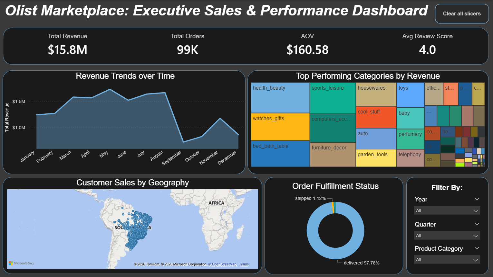
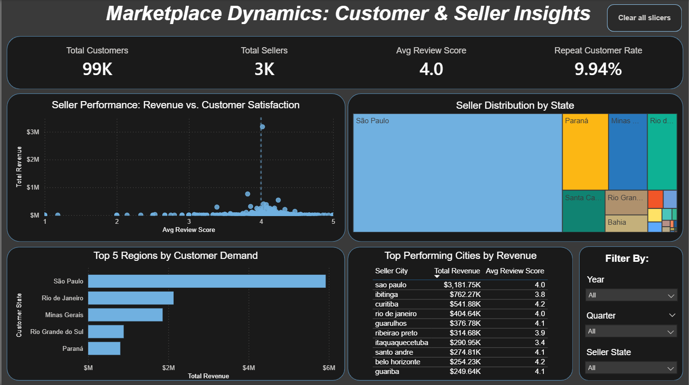
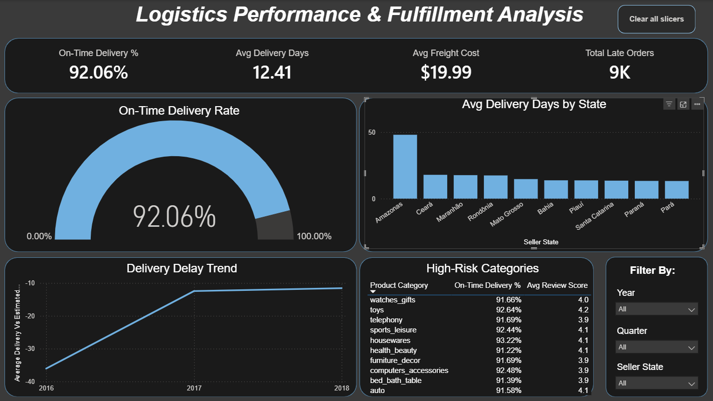
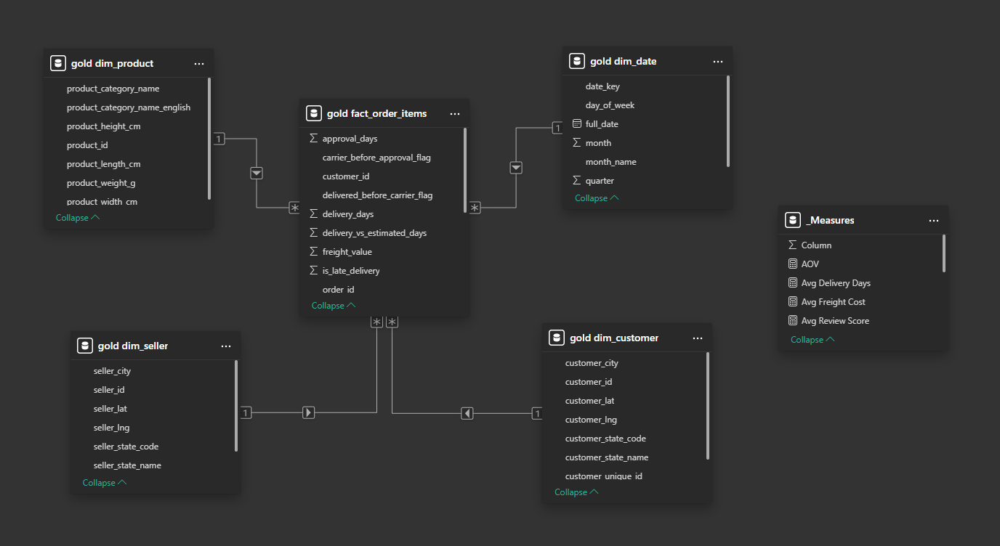

## Olist E-Commerce Data Warehouse & Analytics Project

### 📌 Project Overview

This project demonstrates the design and implementation of an end-to-end data analytics solution. By transforming raw e-commerce data into a clean, business-ready analytical model, I have enabled sophisticated reporting and actionable business insights.

---

### 🎯 Objectives

- **Data Engineering**: Build a structured data warehouse from raw CSV files using a layered architecture (Bronze → Silver → Gold).

- **Data Modeling**: Design a high-performance Star Schema to support scalable analytics.

- **Business Intelligence**: Develop an interactive Power BI dashboard that translates complex relationships into actionable storytelling.

- **Problem Solving**: Identify logistics bottlenecks and trade-corridor efficiencies.

---

### 🏗️ Architecture

The project follows a multi-layered ELT/ETL framework:

***Raw Data → Bronze Layer → Silver Layer → Gold Layer → Power BI Analytics***

---

### ⭐ Data Model (Gold Layer)

The analytical model is designed as a Star Schema, ensuring efficient query performance and clear relationship management:

- **Fact Table**: fact_order_items (includes KPIs like is_late_delivery and delivery_status).

- **Dimension Tables**: dim_customers, dim_products, dim_sellers, dim_date.

---

### Dashboard Previews

*Click each section below to expand the screenshot.*

  
📊 Executive Sales & Performance Dashboard

   
  

  
👥 Customer & Seller Insights

   
  

  
🚚 Logistics Performance & Fulfillment Analysis

   
  

  
📐 Data Model (Star Schema)

   
  

---

### 📊 BI & Visualization Layer (Power BI)

Key technical implementations that drive the dashboard's utility:

- **Bi-Directional Filter Modeling**: Implemented complex cross-filter relationships in the Star Schema, enabling multi-dimensional "corridor analysis" between Customer and Seller regions.

- **Optimized Data Mapping**: Replaced code-based lookups with pre-calculated full-name state columns in dim_customers and dim_sellers, ensuring high-performance data labeling and seamless geographical readability across all charts.

- **Data Storytelling**: Identified a significant logistics bottleneck in the Amazonas (AM) region, providing a clear path for supply chain optimization.

- **User Interactivity**: Added "Clear All Slicers" navigation buttons and dynamic DAX-driven titles for a seamless user experience.

---

### 💡 Key Business Findings

- **Regional Bottlenecks**: Identified that sellers in the Amazonas (AM) region face significantly higher delivery lead times compared to the national average.

- **Marketplace Correlation**: Discovered a direct correlation between specific seller locations and customer review scores, allowing for targeted vendor-performance interventions.

---

### 🛠️ Technologies Used

- **SQL Server & T-SQL**: ETL pipelines and Gold layer view creation.

- **Power BI**: DAX, Star Schema Modeling, Interactive UI.

- **GitHub**: Version control and documentation.

---

### 🚀 Future Improvements

- **Performance Optimization**: Implement indexing on key fact table columns for faster query execution.

- **Advanced Orchestration**: Integrate with Azure Data Factory for automated scheduling.

- **Predictive Analytics**: Incorporate forecasting models for revenue and logistics demand.

---

*[Download the Power BI report file here](https://github.com/Meenakshi0313/olist-ecommerce-analytics/blob/main/Power%20BI/Olist_E-commerce_Analytics_v1.0.pbix).*

---

### Author: 

Meenakshi Singh | Data Analyst | SQL | Data Modeling | Business Intelligence

