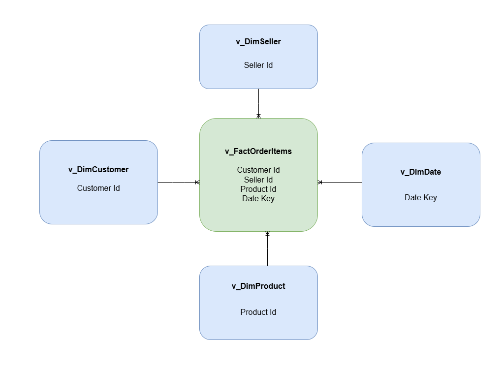

# Olist E-Commerce Executive BI Suite

  <a href="#-executive-bi-dashboard-suite"><b>📊 View Dashboards</b></a> •
  <a href="SQL_Scripts/02_Gold_Reporting_Views.sql"><b>💾 T-SQL Gold Views Script</b></a> •
  <a href="Report_and_Dashboard/Olist_E-commerce_Analytics_Dashboard.pbix"><b>📦 Download .PBIX Model</b></a> •
  <a href="Report_and_Dashboard/Olist_E-commerce_Analytics_Dashboard.pdf"><b>📄 View Compiled PDF</b></a> •
  <a href="https://www.kaggle.com/datasets/olistbr/brazilian-ecommerce"><b>💾 Source Dataset (Kaggle)</b></a>

---

## 🚀 Project Overview

This project transforms raw marketplace transaction data from Olist E-commerce into a multi-page, enterprise-grade Power BI Executive Suite. The solution bridges the gap between raw data engineering and executive data storytelling, providing critical insights into operational performance, customer sentiment distribution, geographic revenue drivers, and logistics supply chain bottlenecks.

The final artifact empowers executive leadership to make fast, data-driven decisions regarding marketplace growth, vendor quality management, and delivery velocity mitigation.

### 📈 Strategic Data Scoping & Cleaning Decisions

* **Analysis Timeframe:** January 2017 – August 2018 *(Scoped out Q3/Q4 2016)*.
* **Business Rationale:** Initial exploratory data analysis (EDA) in SQL revealed that the dataset's trailing 2016 months represented Olist's closed beta/launch phase. Transaction volumes were near zero, certain core operational tables were incomplete, and November 2016 contained zero records due to platform system migration.
* **Impact:** To protect the mathematical integrity of Month-over-Month (MoM) trend calculations and prevent severe visual skewing on executive reporting pages, the operational scope was purposefully normalized to begin on January 1, 2017, capturing the stabilized growth phase of the marketplace.

---

## 🏗️ Data Architecture & Star Schema

To eliminate relational data fan-out, prevent item duplication, and optimize query performance for complex analytical DAX measures, the raw data tier was modeled into an optimized **Star Schema** utilizing custom T-SQL Views (serving as a high-performance Gold Layer).

The structure establishes clean 1-to-many relationship boundaries running from isolated master dimension tables directly into a centralized transaction fact table.

### Relational Schema Blueprint
Below is the architectural blueprint of the dimensional model designed for this analytics suite:

#### Schema Integrity Highlights:
* **Central Transaction Fact (`v_FactOrderItems`):** Consolidates order-level entries, item pricing, and freight distributions while computing performance flags natively in SQL to reduce engine overhead.
* **Granular Master Dimensions:** Standardized master lookups for customers, products, and sellers (`v_DimCustomer`, `v_DimProduct`, `v_DimSeller`) to enable multi-faceted slicing without duplicating metric tallies.
* **Independent Time Intelligence (`v_DimDate`):** A custom generated chronological calendar using recursive CTE logic to guarantee seamless temporal reporting boundaries across all quarters and months.

---

## 📊 Executive BI Dashboard Suite

The interface is structured as a cohesive, high-density dashboard product featuring consistent typography, synchronized grid alignment, responsive color-coded visual alerts, and custom navigation layouts. 

Instead of cluttering the documentation layout, toggle the links below to expand the high-resolution production views of each reporting page:

| Page Name | Strategic Analytical Focus & Core Business Value | Interactive Visual Asset |
| :--- | :--- | :--- |
| **01. Central Navigation Hub** | Serves as a streamlined executive landing platform featuring modular curved navigation cards and synchronized dashboard entry gateways. | [🖼️ View Page Link](Assets/01_Home_Page.png) |
| **02. Executive Strategic Suite** | Tracks macro-level enterprise health indicators including Gross Revenue growth trends, Target Attainment metrics, and Profitability Contribution matrix segments. | [🖼️ View Page Link](Assets/02_Executive_Strategic_Suite.png) |
| **03. Logistics Intelligence** | Isolates shipping velocity metrics, monitors regional delivery transit bottlenecks, tracks SLA compliance drops, and correlates freight burdens against speed. | [🖼️ View Page Link](Assets/03_Logistics_Intelligence.png) |
| **04. Ecosystem & Network Dynamics** | Maps marketplace scaling health by tracking active buyer/vendor concentration ratios, user retention velocities, and multidimensional customer satisfaction indexes. | [🖼️ View Page Link](Assets/04_Ecosystem_&_Network_Dynamics.png) |
| **05. Product Portfolio Performance** | Automates catalog health scoring using specialized conditional formatting matrices to isolate low-rating/high-margin inventory exposure risks. | [🖼️ View Page Link](Assets/05_Product_Portfolio_Performance.png) |

---

## 🛠️ Technical Stack & Implementation Steps

1. **Data Engineering (SQL Server):** Authored robust DDL transformation scripts to isolate historical transactional periods (2017–2018), aggregate nested order payments/reviews via pre-compiled CTE blocks, and neutralize geolocation fan-out through prefix coordinate averaging.
2. **Data Modeling (Power BI):** Deployed a strict Star Schema framework, configured custom unidirectional sorting filters, and created hidden logical keys to support seamless time-intelligence calculation routing.
3. **Analytical DAX Engineering:** Developed performance-optimized business metrics including Pareto (80/20 rule) category classification, rolling transaction velocities, multi-criteria quota attainments, and dynamic color-alert triggers.
4. **UI/UX & Product Design:** Engineered an immersive dark-themed executive interface using a strict alignment system, consistent margin grids, left-aligned slicer caption identifiers, and dynamic conditional visual states.

---

## 📦 How to Explore the Model Locally

The complete engineering scripts and compiled interactive models are open-source and hosted within this repository:
* Browse the SQL optimization logic inside the `/SQL_Scripts/` folder.
* Download the compiled **`Olist_Ecommerce_Analytics_Dashboard.pbix`** file inside the `/Report_and_Dashboard/` directory to inspect live DAX calculations, evaluation contexts, and model relationships within Power BI Desktop.

---

**Author:** Meenakshi Singh  

*Data Professional | SQL Engineering | Power BI Architecture*

*Portfolio Focus: Business Intelligence & Strategic Analytics*
